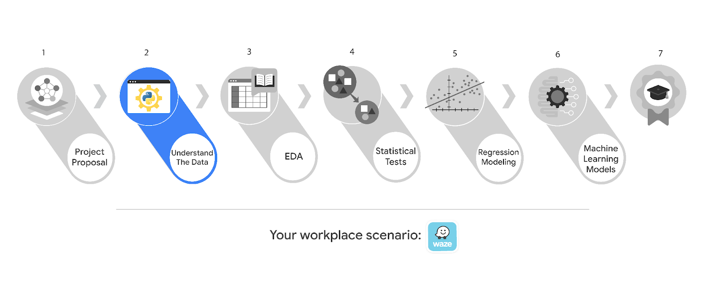

# Course 2 end-of-course portfolio project overview: Waze

A visual representation of the project process is provided in the graphic shown here:

### Background on the Waze scenario

Waze’s free navigation app makes it easier for drivers around the world to get to where they want to go. Waze’s community of map editors, beta testers, translators, partners, and users helps make each drive better and safer. Waze partners with cities, transportation authorities, broadcasters, businesses, and first responders to help as many people as possible travel more efficiently and safely. 

You’ll collaborate with your Waze teammates to analyze and interpret data, generate valuable insights, and help leadership make informed business decisions. Your team is about to start a new project to help prevent user churn on the Waze app. Churn quantifies the number of users who have uninstalled the Waze app or stopped using the app. This project focuses on monthly user churn. 

This project is part of a larger effort at Waze to increase growth. Typically, high retention rates indicate satisfied users who repeatedly use the Waze app over time. Developing a churn prediction model will help prevent churn, improve user retention, and grow Waze’s business. An accurate model can also help identify specific factors that contribute to churn and answer questions such as: 

Who are the users most likely to churn?

Why do users churn? 

When do users churn? 

For example, if Waze can identify a segment of users who are at high risk of churning, Waze can proactively engage these users with special offers to try and retain them. Otherwise, Waze may lose these users without knowing why. 

Your insights will help Waze leadership optimize the company’s retention strategy, enhance user experience, and make data-driven decisions about product development.

### Project background

Waze’s data team is in the earliest stages of the churn project. The following tasks are needed before the team can begin the data analysis process:

- Build a dataframe for the churn dataset

- Examine data type of each column

- Gather descriptive statistics

You will build a dataframe for the churn data. After the dataframe is complete, you will organize the data for the process of exploratory data analysis, and update the team on your progress and insights.

### Team members at Waze

##### Data team roles

- Harriet Hadzic - Director of Data Analysis 

- May Santner - Data Analysis Manager 

- Chidi Ga - Senior Data Analyst 

- Sylvester Esperanza - Senior Project Manager 

Data team members have technical experience with data analysis and data science. However, you should always be sure to keep summaries and messages to these team members concise and to the point. 

#### Cross-functional team members

- Emrick Larson - Finance and Administration Department Head 

- Ursula Sayo - Operations Manager 

Your Waze team includes several managers overseeing operations. It is important to adapt your communication to their roles since their responsibilities are less technical.

Note: The story, all names, characters, and incidents portrayed in this project are fictitious. No identification with actual persons (living or deceased) is intended or should be inferred. And, the data shared in this project has been created for pedagogical purposes. 

# Specific project deliverables

With this end-of-course project, you will gain valuable practice and apply your new skills as you complete the following:

- Complete the questions in the Course 2 PACE strategy document

- Answer the questions in the Jupyter notebook project file

- Complete coding prep work on project’s Jupyter notebook

- Summarize the column Dtypes

- The Google Advanced Data Analytics Certificate end-of-course project is designed for you to practice and apply course skills in a fictional workplace scenario. By completing each course’s end-of-course project, you will have work examples that will enhance your portfolio and showcase your skills for future employers. 